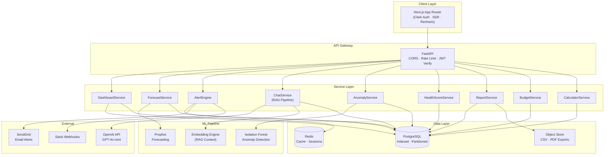
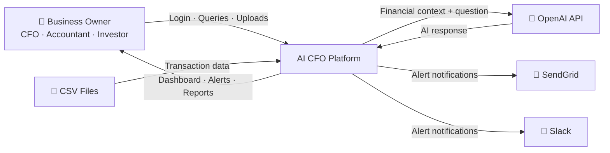
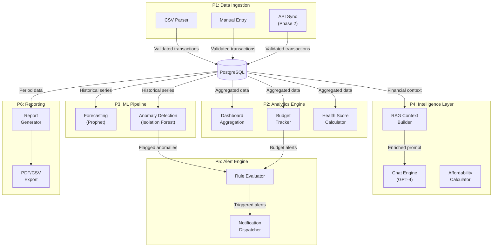
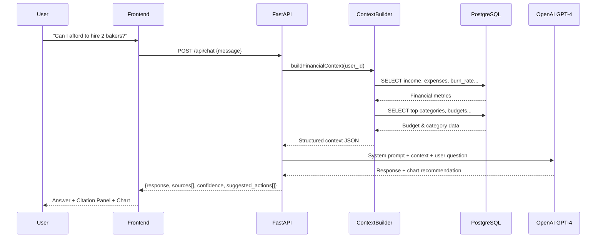
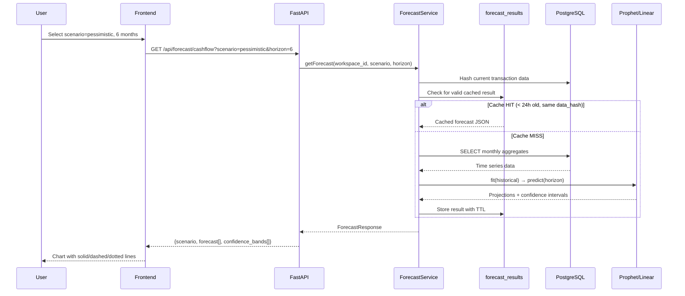

# AI CFO Platform — Scalable Industry Architecture

> Complete re-architecture from MVP template to production-grade, low-latency, event-driven financial intelligence platform.

---

## Executive Summary

After deep analysis of the codebase (14 backend files, 13 frontend pages, 1 API layer, MVP plan document), this plan addresses **3 critical architectural gaps**:

1. **Frontend ↔ Backend contract mismatch** — Types don't match API responses
2. **5 unregistered backend routers** — `anomaly`, `health_score`, `reports`, `settings` exist but aren't wired into `main.py`
3. **Missing database models** — No models for `Goal`, `AuditLog`, `Workspace`, `IndustryBenchmark`, `ForecastResult`
4. **Empty `services/` and `ml/` directories** — No business logic separation, no ML pipeline

---

## 1. Target Architecture



---

## 2. Database Schema — Indexed, Dynamic, Multi-Tenant

### 2.1 Current State vs Target

| Model | Current | Target | Gap |
|-------|---------|--------|-----|
| `User` | ✅ Basic | Add `workspace_id`, `avatar_url` | Minor |
| `Transaction` | ✅ Good indexes | Add composite indexes, partitioning | Optimization |
| `Budget` | ⚠️ Missing `alert_threshold` in model | Full rewrite with `Goal` support | Major |
| `Alert` | ⚠️ Missing `AlertSeverity` enum | Add `action_url`, severity enum | Medium |
| `ChatMessage` | ✅ Basic | Add `sources_json`, `confidence` | Medium |
| `Workspace` | ❌ Missing | Multi-tenant container | **New** |
| `Goal` | ❌ Missing | Feature 5 requirement | **New** |
| `AuditLog` | ❌ Missing | Feature D requirement | **New** |
| `ForecastResult` | ❌ Missing | Cache expensive computations | **New** |
| `IndustryBenchmark` | ❌ Missing | Feature C requirement | **New** |
| `AlertRule` | ❌ Missing | User-configurable thresholds | **New** |

### 2.2 Complete Schema (PostgreSQL DDL)

```sql
-- ═══════════════════════════════════════════════
-- WORKSPACE (Multi-tenant container)
-- ═══════════════════════════════════════════════
CREATE TABLE workspaces (
    id            UUID PRIMARY KEY DEFAULT gen_random_uuid(),
    name          VARCHAR(255) NOT NULL,
    industry      VARCHAR(50)  NOT NULL DEFAULT 'general_smb',
    currency      VARCHAR(3)   NOT NULL DEFAULT 'USD',
    fiscal_year_start SMALLINT NOT NULL DEFAULT 1,  -- month 1-12
    is_demo       BOOLEAN      NOT NULL DEFAULT FALSE,
    created_at    TIMESTAMPTZ  NOT NULL DEFAULT NOW(),
    updated_at    TIMESTAMPTZ  NOT NULL DEFAULT NOW()
);
CREATE INDEX idx_workspaces_industry ON workspaces(industry);

-- ═══════════════════════════════════════════════
-- USERS (Enhanced with workspace + Clerk)
-- ═══════════════════════════════════════════════
CREATE TYPE user_role AS ENUM ('owner','admin','cfo','accountant','investor','employee');

CREATE TABLE users (
    id            UUID PRIMARY KEY DEFAULT gen_random_uuid(),
    clerk_id      VARCHAR(255) UNIQUE,               -- Clerk external ID
    workspace_id  UUID NOT NULL REFERENCES workspaces(id) ON DELETE CASCADE,
    email         VARCHAR(255) NOT NULL,
    full_name     VARCHAR(255) NOT NULL,
    role          user_role    NOT NULL DEFAULT 'owner',
    avatar_url    TEXT,
    is_active     BOOLEAN      NOT NULL DEFAULT TRUE,
    last_login_at TIMESTAMPTZ,
    created_at    TIMESTAMPTZ  NOT NULL DEFAULT NOW()
);
CREATE UNIQUE INDEX idx_users_email_ws ON users(email, workspace_id);
CREATE INDEX idx_users_workspace ON users(workspace_id);
CREATE INDEX idx_users_clerk ON users(clerk_id);

-- ═══════════════════════════════════════════════
-- TRANSACTIONS (Partitioned by date for scale)
-- ═══════════════════════════════════════════════
CREATE TYPE txn_type AS ENUM ('income','expense');

CREATE TABLE transactions (
    id            UUID PRIMARY KEY DEFAULT gen_random_uuid(),
    workspace_id  UUID         NOT NULL REFERENCES workspaces(id),
    user_id       UUID         NOT NULL REFERENCES users(id),
    date          TIMESTAMPTZ  NOT NULL,
    description   VARCHAR(500) NOT NULL,
    amount        NUMERIC(14,2) NOT NULL CHECK (amount >= 0),
    category      VARCHAR(100) NOT NULL,
    type          txn_type     NOT NULL,
    account       VARCHAR(100) NOT NULL DEFAULT 'Main Account',
    vendor        VARCHAR(200),
    notes         TEXT,
    is_anomaly    BOOLEAN      NOT NULL DEFAULT FALSE,
    anomaly_score REAL,
    source        VARCHAR(20)  NOT NULL DEFAULT 'manual',  -- manual|csv|api
    created_at    TIMESTAMPTZ  NOT NULL DEFAULT NOW()
);
-- Critical performance indexes
CREATE INDEX idx_txn_ws_date     ON transactions(workspace_id, date DESC);
CREATE INDEX idx_txn_ws_cat_date ON transactions(workspace_id, category, date DESC);
CREATE INDEX idx_txn_ws_type     ON transactions(workspace_id, type);
CREATE INDEX idx_txn_user        ON transactions(user_id);
CREATE INDEX idx_txn_anomaly     ON transactions(workspace_id, is_anomaly)
    WHERE is_anomaly = TRUE;
CREATE INDEX idx_txn_vendor      ON transactions(workspace_id, vendor)
    WHERE vendor IS NOT NULL;

-- ═══════════════════════════════════════════════
-- BUDGETS (Monthly category budgets)
-- ═══════════════════════════════════════════════
CREATE TABLE budgets (
    id              UUID PRIMARY KEY DEFAULT gen_random_uuid(),
    workspace_id    UUID        NOT NULL REFERENCES workspaces(id),
    user_id         UUID        NOT NULL REFERENCES users(id),
    category        VARCHAR(100) NOT NULL,
    monthly_limit   NUMERIC(12,2) NOT NULL CHECK (monthly_limit > 0),
    alert_threshold REAL        NOT NULL DEFAULT 0.8,  -- 0.0–1.0
    month           VARCHAR(7)  NOT NULL,               -- YYYY-MM
    created_at      TIMESTAMPTZ NOT NULL DEFAULT NOW()
);
CREATE UNIQUE INDEX idx_budget_ws_cat_month
    ON budgets(workspace_id, category, month);
CREATE INDEX idx_budget_user ON budgets(user_id);

-- ═══════════════════════════════════════════════
-- GOALS (Financial targets — Feature 5)
-- ═══════════════════════════════════════════════
CREATE TYPE goal_status AS ENUM ('active','completed','abandoned');

CREATE TABLE goals (
    id              UUID PRIMARY KEY DEFAULT gen_random_uuid(),
    workspace_id    UUID         NOT NULL REFERENCES workspaces(id),
    user_id         UUID         NOT NULL REFERENCES users(id),
    title           VARCHAR(255) NOT NULL,
    target_value    NUMERIC(14,2) NOT NULL,
    current_value   NUMERIC(14,2) NOT NULL DEFAULT 0,
    metric_type     VARCHAR(50)  NOT NULL,   -- revenue|savings|expense_reduction
    deadline        DATE,
    status          goal_status  NOT NULL DEFAULT 'active',
    created_at      TIMESTAMPTZ  NOT NULL DEFAULT NOW(),
    updated_at      TIMESTAMPTZ  NOT NULL DEFAULT NOW()
);
CREATE INDEX idx_goals_ws_status ON goals(workspace_id, status);

-- ═══════════════════════════════════════════════
-- ALERTS (Enhanced with severity enum + actions)
-- ═══════════════════════════════════════════════
CREATE TYPE alert_severity AS ENUM ('info','warning','critical');

CREATE TABLE alerts (
    id          UUID PRIMARY KEY DEFAULT gen_random_uuid(),
    workspace_id UUID        NOT NULL REFERENCES workspaces(id),
    user_id     UUID         NOT NULL REFERENCES users(id),
    title       VARCHAR(255) NOT NULL,
    message     TEXT         NOT NULL,
    severity    alert_severity NOT NULL DEFAULT 'info',
    category    VARCHAR(100) NOT NULL,
    action_url  TEXT,
    is_read     BOOLEAN      NOT NULL DEFAULT FALSE,
    dismissed_at TIMESTAMPTZ,
    created_at  TIMESTAMPTZ  NOT NULL DEFAULT NOW()
);
CREATE INDEX idx_alerts_ws_unread ON alerts(workspace_id, is_read, created_at DESC)
    WHERE is_read = FALSE;
CREATE INDEX idx_alerts_user ON alerts(user_id, created_at DESC);

-- ═══════════════════════════════════════════════
-- ALERT RULES (User-configurable triggers)
-- ═══════════════════════════════════════════════
CREATE TABLE alert_rules (
    id              UUID PRIMARY KEY DEFAULT gen_random_uuid(),
    workspace_id    UUID         NOT NULL REFERENCES workspaces(id),
    rule_type       VARCHAR(50)  NOT NULL,   -- low_cash|short_runway|overspend|revenue_drop
    threshold_value NUMERIC(14,2) NOT NULL,
    is_enabled      BOOLEAN      NOT NULL DEFAULT TRUE,
    notify_email    BOOLEAN      NOT NULL DEFAULT TRUE,
    notify_slack    BOOLEAN      NOT NULL DEFAULT FALSE,
    slack_webhook   TEXT,
    created_at      TIMESTAMPTZ  NOT NULL DEFAULT NOW()
);
CREATE INDEX idx_alert_rules_ws ON alert_rules(workspace_id, is_enabled)
    WHERE is_enabled = TRUE;

-- ═══════════════════════════════════════════════
-- CHAT MESSAGES (Enhanced with RAG metadata)
-- ═══════════════════════════════════════════════
CREATE TABLE chat_messages (
    id           UUID PRIMARY KEY DEFAULT gen_random_uuid(),
    workspace_id UUID        NOT NULL REFERENCES workspaces(id),
    user_id      UUID        NOT NULL REFERENCES users(id),
    session_id   VARCHAR(50) NOT NULL,
    role         VARCHAR(20) NOT NULL,  -- user|assistant
    content      TEXT        NOT NULL,
    sources_json JSONB,                  -- citation data
    confidence   VARCHAR(10),            -- high|medium|low
    created_at   TIMESTAMPTZ NOT NULL DEFAULT NOW()
);
CREATE INDEX idx_chat_session ON chat_messages(session_id, created_at);
CREATE INDEX idx_chat_user    ON chat_messages(user_id, created_at DESC);

-- ═══════════════════════════════════════════════
-- FORECAST RESULTS (Cache expensive ML runs)
-- ═══════════════════════════════════════════════
CREATE TABLE forecast_results (
    id              UUID PRIMARY KEY DEFAULT gen_random_uuid(),
    workspace_id    UUID        NOT NULL REFERENCES workspaces(id),
    scenario        VARCHAR(20) NOT NULL,   -- optimistic|base|pessimistic
    horizon_months  SMALLINT    NOT NULL,
    result_json     JSONB       NOT NULL,    -- full forecast payload
    model_version   VARCHAR(20) NOT NULL DEFAULT 'v1_linear',
    data_hash       VARCHAR(64) NOT NULL,    -- SHA256 of input data
    computed_at     TIMESTAMPTZ NOT NULL DEFAULT NOW(),
    expires_at      TIMESTAMPTZ NOT NULL
);
CREATE INDEX idx_forecast_ws_scenario ON forecast_results(workspace_id, scenario);
CREATE INDEX idx_forecast_expires ON forecast_results(expires_at);

-- ═══════════════════════════════════════════════
-- AUDIT LOG (Feature D — Change tracking)
-- ═══════════════════════════════════════════════
CREATE TABLE audit_logs (
    id           UUID PRIMARY KEY DEFAULT gen_random_uuid(),
    workspace_id UUID        NOT NULL REFERENCES workspaces(id),
    user_id      UUID        NOT NULL REFERENCES users(id),
    action       VARCHAR(50) NOT NULL,   -- budget.create|forecast.run|alert.dismiss|...
    entity_type  VARCHAR(50) NOT NULL,   -- budget|transaction|alert|report|forecast
    entity_id    UUID,
    old_value    JSONB,
    new_value    JSONB,
    ip_address   INET,
    created_at   TIMESTAMPTZ NOT NULL DEFAULT NOW()
);
CREATE INDEX idx_audit_ws_time ON audit_logs(workspace_id, created_at DESC);
CREATE INDEX idx_audit_entity  ON audit_logs(entity_type, entity_id);
CREATE INDEX idx_audit_user    ON audit_logs(user_id, created_at DESC);

-- ═══════════════════════════════════════════════
-- INDUSTRY BENCHMARKS (Feature C — Static ref data)
-- ═══════════════════════════════════════════════
CREATE TABLE industry_benchmarks (
    id           UUID PRIMARY KEY DEFAULT gen_random_uuid(),
    industry     VARCHAR(50)  NOT NULL,  -- saas|retail|agency|general_smb
    metric_name  VARCHAR(100) NOT NULL,  -- gross_margin|cac|marketing_pct|...
    metric_value NUMERIC(10,2) NOT NULL,
    unit         VARCHAR(20)  NOT NULL DEFAULT 'percentage',
    source       VARCHAR(255),
    year         SMALLINT     NOT NULL DEFAULT 2025,
    updated_at   TIMESTAMPTZ  NOT NULL DEFAULT NOW()
);
CREATE UNIQUE INDEX idx_benchmark_unique
    ON industry_benchmarks(industry, metric_name, year);
```

---

## 3. Data Flow Diagrams

### 3.1 DFD Level 0 — System Context



### 3.2 DFD Level 1 — Core Processes



### 3.3 DFD Level 2 — Chat RAG Pipeline (Detail)



### 3.4 DFD Level 2 — Forecasting Pipeline



---

## 4. Full Data Pipeline

### 4.1 Ingestion Pipeline

```
CSV Upload → Validate Headers → Map Columns → Parse Rows
   → Type Detection (income/expense) → Category Assignment
   → Anomaly Pre-scan → Bulk INSERT → Audit Log Entry
   → Trigger: recalculate budgets → Trigger: check alert rules
```

### 4.2 Real-Time Processing Pipeline

```
Transaction Created/Updated
   ├─→ Budget Service: recalculate current_spend for category+month
   ├─→ Alert Engine: evaluate all active rules for workspace
   │      ├─→ Low Cash → email + in-app
   │      ├─→ Overspend → in-app notification
   │      └─→ Anomaly → flag + in-app
   ├─→ Forecast Cache: invalidate stale forecasts
   └─→ Audit Log: record change with before/after
```

---

## 5. Proposed Changes

### 5.1 Backend — New Models

#### [MODIFY] [models.py](file:///c:/CFO/backend/models.py)
- Add `Workspace`, `Goal`, `AuditLog`, `ForecastResult`, `IndustryBenchmark`, `AlertRule` models
- Add `workspace_id` foreign key to all existing models
- Add `AlertSeverity` enum (referenced in `alerts.py` but missing from models)
- Change `amount` from `Float` to `Numeric(14,2)` for financial precision
- Add `anomaly_score` field to `Transaction`

#### [MODIFY] [schemas.py](file:///c:/CFO/backend/schemas.py)
- Add Pydantic schemas for all new models
- Add `DashboardSummaryResponse` that matches frontend `DashboardSummary` type
- Add `ForecastResponse` schema matching frontend contract

---

### 5.2 Backend — Wire Missing Routers

#### [MODIFY] [main.py](file:///c:/CFO/backend/main.py)
Register the 5 unregistered routers:
```python
from routers import anomaly, health_score, reports, settings
# ... (already imported: auth, transactions, dashboard, forecasting, alerts, budgets, chat)

app.include_router(anomaly.router,      prefix="/api/anomalies",    tags=["anomalies"])
app.include_router(health_score.router,  prefix="/api/health-score", tags=["health-score"])
app.include_router(reports.router,       prefix="/api/reports",      tags=["reports"])
app.include_router(settings.router,      prefix="/api/settings",     tags=["settings"])
```

---

### 5.3 Backend — New Service Layer

#### [NEW] `backend/services/dashboard_service.py`
- Consolidate dashboard aggregation logic (currently inline in router)
- Add Redis caching for summary with 5-min TTL

#### [NEW] `backend/services/forecast_service.py`
- Extract forecasting logic from router
- Add Prophet integration (Phase 2 fallback to linear)
- Implement forecast caching with `data_hash` validation

#### [NEW] `backend/services/alert_engine.py`
- Scheduled alert rule evaluator
- Multi-channel dispatch (in-app, email, Slack)
- Configurable thresholds via `alert_rules` table

#### [NEW] `backend/services/audit_service.py`
- Decorator-based audit logging
- Before/after value capture for all mutations

#### [NEW] `backend/services/calculator_service.py`
- "What Can I Afford?" logic
- Runway impact modeling
- Break-even analysis

#### [NEW] `backend/services/benchmark_service.py`
- Industry comparison engine
- Static JSON → DB seed script

---

### 5.4 Backend — New Router

#### [NEW] `backend/routers/calculator.py`
- `POST /api/calculator/afford` — affordability check
- `POST /api/calculator/hire` — hiring impact analysis

#### [NEW] `backend/routers/goals.py`
- CRUD for financial goals
- Progress tracking against transaction data

#### [NEW] `backend/routers/audit.py`
- `GET /api/audit` — filterable audit log
- Pagination + date range + user + action type filters

#### [NEW] `backend/routers/benchmarks.py`
- `GET /api/benchmarks` — comparison against industry
- Auto-generates top 3 insights

---

### 5.5 Frontend — Fix Type Mismatches

#### [MODIFY] [types.ts](file:///c:/CFO/frontend/lib/types.ts)

> [!WARNING]
> **Critical**: Frontend types don't match backend responses. This causes silent failures.

| Type Field | Frontend | Backend | Fix |
|-----------|----------|---------|-----|
| `Budget.limit_amount` | `limit_amount` | `monthly_limit` | Rename frontend |
| `Budget.spent_amount` | `spent_amount` | `current_spend` | Rename frontend |
| `Alert.is_dismissed` | `is_dismissed` | — (not in model) | Add to backend |
| `Alert.alert_type` | `alert_type` | `category` | Align names |
| `ForecastResponse.data_points` | `data_points` | `forecast` | Align names |
| `ForecastResponse.months_ahead` | `months_ahead` | `horizon_months` | Align names |
| `ChatResponse.reply` | `reply` | `response` | Align names |
| `TransactionOut.id` | `number` | `UUID` | Use `string` |

#### [MODIFY] [api.ts](file:///c:/CFO/frontend/lib/api.ts)
- Add missing API calls: `getHealthScore`, `getReports`, `getAnomalies`, `runAnomalyScan`, `getAuditLog`, `checkAffordability`
- Fix forecast endpoint path (`/forecast/cashflow` not `/forecasting/`)
- Fix alert methods (PATCH not PUT for mark-read)

---

### 5.6 Database Migration

#### [NEW] `backend/migrations/001_initial_schema.sql`
- Complete DDL from Section 2.2 above

#### [NEW] `backend/seed_demo.py`
- Luna Bakery demo workspace with 6 months of realistic data
- Pre-seeded budgets, goals, alerts, and benchmark data
- Deterministic (same data every run for demo reliability)

---

## 6. Frontend ↔ Backend API Contract Summary

| Page | Endpoint | Method | Status |
|------|----------|--------|--------|
| Dashboard | `/api/dashboard/summary` | GET | ✅ Working |
| Dashboard | `/api/dashboard/cashflow-chart` | GET | ✅ Working |
| Dashboard | `/api/dashboard/expense-breakdown` | GET | ✅ Working |
| Dashboard | `/api/health-score/` | GET | ⚠️ Router exists, not registered |
| Transactions | `/api/transactions/` | GET/POST | ✅ Working |
| Transactions | `/api/transactions/upload-csv` | POST | ✅ Working |
| Budgets | `/api/budgets/` | GET/POST/DELETE | ✅ Working |
| Forecasting | `/api/forecast/cashflow` | GET | ✅ Working |
| Alerts | `/api/alerts/` | GET/PATCH | ✅ Working |
| Chat | `/api/chat/` | POST | ✅ Working |
| Anomalies | `/api/anomalies/` | GET | ⚠️ Not registered |
| Anomalies | `/api/anomalies/run-scan` | POST | ⚠️ Not registered |
| Reports | `/api/reports/summary` | GET | ⚠️ Not registered |
| Reports | `/api/reports/export/csv` | GET | ⚠️ Not registered |
| Settings | `/api/settings/profile` | GET/PUT | ⚠️ Not registered |
| Settings | `/api/settings/users` | GET/POST | ⚠️ Not registered |
| Calculator | `/api/calculator/afford` | POST | ❌ Not built |
| Goals | `/api/goals/` | CRUD | ❌ Not built |
| Audit | `/api/audit/` | GET | ❌ Not built |
| Benchmarks | `/api/benchmarks/` | GET | ❌ Not built |
| Investor | `/api/dashboard/investor-view` | GET | ❌ Not built |

---

## 7. Execution Priority

### Phase 1 — Foundation Fix (Critical Path)
1. Wire 5 missing routers into `main.py`
2. Fix frontend type mismatches in `types.ts` / `api.ts`
3. Add `AlertSeverity` enum to models (fixes import error in `alerts.py`)
4. Create Alembic migration setup

### Phase 2 — Schema Expansion
5. Add `Workspace` model + multi-tenant FK
6. Add `Goal`, `AuditLog`, `ForecastResult` models
7. Create `seed_demo.py` for Luna Bakery data
8. Build service layer (extract logic from routers)

### Phase 3 — New Features
9. Calculator router + service
10. Goals router + service  
11. Audit trail router + service
12. Industry benchmarks (static seed + comparison API)
13. Investor-view dashboard endpoint

### Phase 4 — ML Pipeline
14. Prophet integration in `ml/forecasting.py`
15. Isolation Forest in `ml/anomaly.py`
16. Forecast caching with `data_hash` validation

---

## Open Questions

> [!IMPORTANT]
> **Auth Strategy**: The backend uses custom JWT (`auth.py`) but the frontend uses Clerk (`useAuth`). Which should be the source of truth? Options:
> - **A)** Clerk-only: Backend validates Clerk JWTs (recommended for production)
> - **B)** Dual: Keep custom JWT for API testing, Clerk for frontend
> - **C)** Custom JWT only: Remove Clerk

> [!IMPORTANT]
> **Database**: The config has `postgresql+asyncpg` but are you running PostgreSQL locally, or should we use SQLite for development? The current `config.py` defaults to PostgreSQL.

> [!WARNING]
> **Redis**: The architecture includes Redis for caching. Shall we add it now or defer to Phase 2 and use in-memory caching initially?

---

## Verification Plan

### Automated Tests
```bash
# Backend
cd backend
pytest tests/ -v --cov=routers --cov=services
# Test each endpoint with httpx AsyncClient

# Frontend  
cd frontend
npm run build   # Verify no TypeScript errors
npm run lint    # Verify no lint issues
```

### Manual Verification
- Start backend: `uvicorn main:app --reload`
- Start frontend: `npm run dev`
- Navigate to `localhost:3000/dashboard` — verify all 7 KPI cards render
- Navigate to `/anomalies` — verify scan runs
- Navigate to `/reports` — verify CSV export downloads
- Navigate to `/settings` — verify profile loads
- Test CSV upload with sample Luna Bakery data
